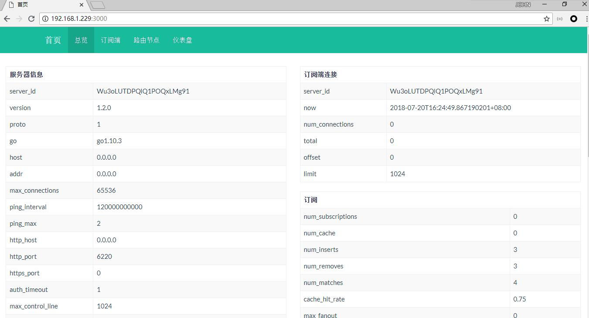
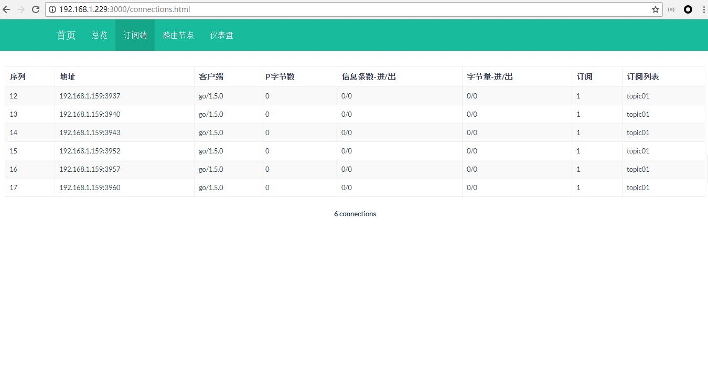
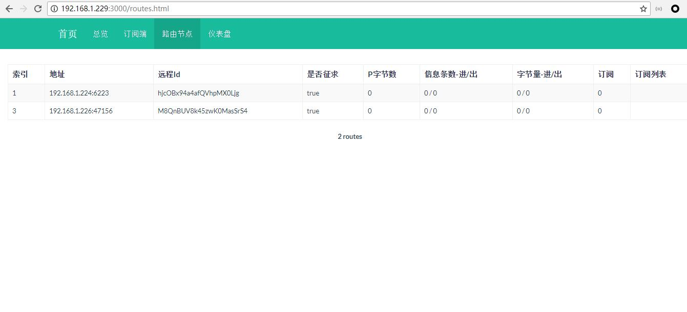
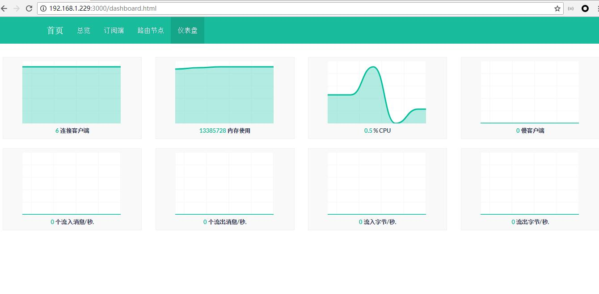

# gmessage-monitor

[![NPM][npm-image]][npm-url] [![Build Status][travis-image]][travis-url]

Dashboard for monitoring gmessage. It provides real-time information from gmessage server. 









## Installation

```bash
npm install gmessage-monitor -g
```

## Usage

[gmessage server]**must** be running with `-m` parameter.

```bash
gmessage -m 6220
gmessage-monitor

# Custom port
gmessage -m 6220
gmessage-monitor --gmonitor-url http://192.168.1.225:6220
```

